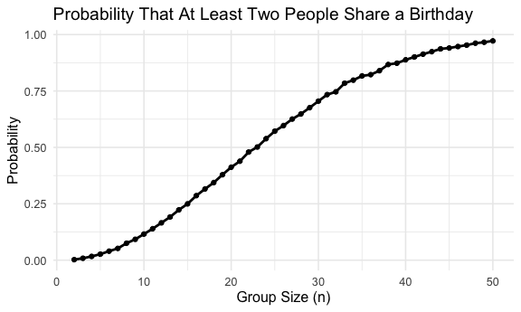

Homework5_zc2823
================
2025-10-30

# Problem 1

### Define function: return if there is duplicate birthday

``` r
birthday_sim = function(n) {
  birthdays = sample(1:365, n, replace = TRUE)
  any(duplicated(birthdays))
}
```

### Simulation: 10000 times for each group size between 2 and 50

``` r
sim_results = 
  tibble(group_size = 2:50) %>% 
  mutate(probability = map_dbl(group_size, function(n) {
    mean(replicate(10000, birthday_sim(n)))
  }))
```

### Make a plot

``` r
sim_results %>% 
  ggplot(aes(x = group_size, y = probability)) +
  geom_line(size = 1) +
  geom_point(size = 1.5) +
  labs(
    title = "Probability That At Least Two People Share a Birthday",
    x = "Group Size (n)",
    y = "Probability"
  ) +
  theme_minimal(base_size = 12)
```

    ## Warning: Using `size` aesthetic for lines was deprecated in ggplot2 3.4.0.
    ## ℹ Please use `linewidth` instead.
    ## This warning is displayed once every 8 hours.
    ## Call `lifecycle::last_lifecycle_warnings()` to see where this warning was
    ## generated.


