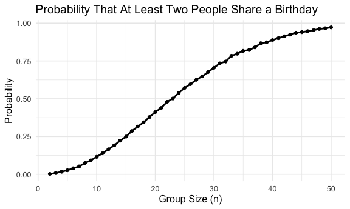
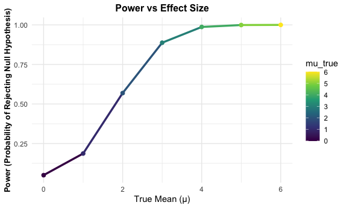
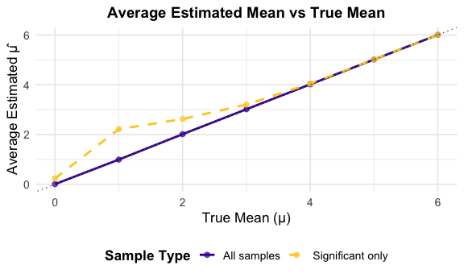
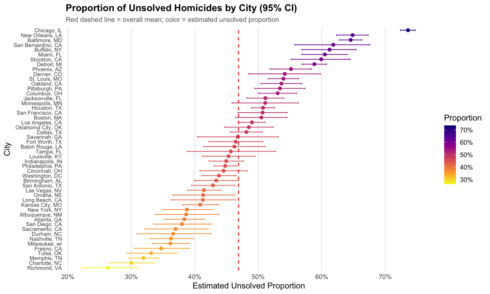

Homework5_zc2823
================
2025-10-30

# Problem 1

### Define function: return if there is duplicate birthday

``` r
birthday_sim = function(n) {
  birthdays = sample(1:365, n, replace = TRUE)
  any(duplicated(birthdays))
}
```

### Simulation: 10000 times for each group size between 2 and 50

``` r
sim_results = 
  tibble(group_size = 2:50) %>% 
  mutate(probability = map_dbl(group_size, function(n) {
    mean(replicate(10000, birthday_sim(n)))
  }))
```

### Make a plot

``` r
sim_results %>% 
  ggplot(aes(x = group_size, y = probability)) +
  geom_line(size = 1) +
  geom_point(size = 1.5) +
  labs(
    title = "Probability That At Least Two People Share a Birthday",
    x = "Group Size (n)",
    y = "Probability"
  ) +
  theme_minimal(base_size = 12)
```



The plot shows that the probability of shared birthdays increases
rapidly with group size. Around n = 23, the probability exceeds 0.5, and
by n ≈ 40, it’s close to 1. This confirms the birthday paradox—shared
birthdays become likely even in relatively small groups.

# Problem 2

### Parameter setting

``` r
n = 30
sigma = 5
mu_list = 0:6
n_sim = 5000
```

### Define the function: generate datasets, t test, return the result

``` r
sim_ttest = function(mu) {
  map_dfr(1:n_sim, function(i) {
    x = rnorm(n, mean = mu, sd = sigma)
    t_out = tidy(t.test(x, mu = 0))
    tibble(
      mu_true = mu,
      mu_hat = t_out$estimate,   # mean of this sample
      p_value = t_out$p.value    # corresponding p-value
    )
  })
}
```

### Simulation for mu

``` r
sim_results = map_dfr(mu_list, sim_ttest)
```

### Calculte power

``` r
power_df = 
  sim_results %>% 
  group_by(mu_true) %>% 
  summarize(power = mean(p_value < 0.05))
```

### Make a plot showing the proportion of times the null was rejected

``` r
ggplot(power_df, aes(x = mu_true, y = power, color = mu_true)) +
  geom_line(size = 1.2) +
  geom_point(size = 2) +
  scale_color_viridis_c() +
  labs(
    title = "Power vs Effect Size",
    x = "True Mean (μ)",
    y = "Power (Probability of Rejecting Null Hypothesis)"
  ) +
  theme_minimal(base_size = 11) + 
theme(
  axis.title.y = element_text(size = 10, face = "bold"),
  plot.title = element_text(hjust = 0.5, size = 12, face = "bold")
)
```



The plot shows a strong positive association between effect size (true
mean, μ) and power. As μ increases, the probability of rejecting the
null hypothesis rises sharply. When μ = 0, the power is close to the
significance level (≈0.05). As μ increases beyond 3, the power
approaches 1, meaning the test almost always detects the true effect.

### Calculate mu_hat

``` r
mu_summary = sim_results %>%
  group_by(mu_true) %>%
  summarize(
    avg_mu_hat = mean(mu_hat),
    avg_mu_hat_reject = mean(mu_hat[p_value < 0.05])
  )
```

### Plot average estimate vs true value

``` r
ggplot(mu_summary, aes(x = mu_true)) +
  geom_line(aes(y = avg_mu_hat, color = "All samples"), size = 1) +
  geom_point(aes(y = avg_mu_hat, color = "All samples"), size = 2, alpha = 0.7) +
  geom_line(aes(y = avg_mu_hat_reject, color = "Significant only"), 
            size = 1, linetype = "dashed") +
  geom_point(aes(y = avg_mu_hat_reject, color = "Significant only"), 
             size = 2, alpha = 0.7) +
  geom_abline(slope = 1, intercept = 0, linetype = "dotted", color = "gray40") +
  scale_color_viridis_d(option = "C", begin = 0.1, end = 0.9) +
  labs(
    title = "Average Estimated Mean vs True Mean",
    x = "True Mean (μ)",
    y = "Average Estimated μ̂",
    color = "Sample Type"
  ) +
  theme_minimal(base_size = 13) +
  theme(
    legend.position = "bottom",
    legend.title = element_text(face = "bold"),
    plot.title = element_text(hjust = 0.5, face = "bold", size = 14)
  )
```



The plot shows that the average estimated mean (μ̂) across all samples
lies almost perfectly on the 45° reference line, indicating that (μ̂) is
an unbiased estimator of the true mean μ. However, when considering only
samples where the null hypothesis was rejected (p \< 0.05), the average
(μ̂) is higher than the true mean for small μ values. This occurs because
only samples with unusually large sample means produce significant
results when the true effect is small — a phenomenon known as selection
bias or the winner’s curse. As μ increases and statistical power
approaches 1, the two lines converge, since almost all samples become
significant.

# Problem 3

### Load data

``` r
homi_df = read_csv("data/homicide-data.csv") |> 
  clean_names()
```

    ## Rows: 52179 Columns: 12
    ## ── Column specification ────────────────────────────────────────────────────────
    ## Delimiter: ","
    ## chr (9): uid, victim_last, victim_first, victim_race, victim_age, victim_sex...
    ## dbl (3): reported_date, lat, lon
    ## 
    ## ℹ Use `spec()` to retrieve the full column specification for this data.
    ## ℹ Specify the column types or set `show_col_types = FALSE` to quiet this message.

### Describe the raw data

``` r
homi_summary <- homi_df %>%
  mutate(rep_date = ymd_hms(reported_date, quiet = TRUE)) %>%
  summarise(
    n_obs = n(),
    n_vars = ncol(cur_data()),
    n_cities = n_distinct(city),
    n_states = n_distinct(state)
  )
```

This dataset contains 52179 observations and 14 variables, each
representing a single homicide case collected by *The Washington Post*
across 50 U.S. cities and 28 states from roughly 2007–2017.

### Create city_state & summarize totals

``` r
city_summary = homi_df |> 
  mutate(
    city_state = str_c(city, ", ", state),
    unsolved = disposition %in% c("Closed without arrest", "Open/No arrest")
  ) |> 
  group_by(city_state) |> 
  summarise(
    total_homicides = n(),
    unsolved_homicides = sum(unsolved, na.rm = TRUE),
    .groups = "drop"
  ) |> 
  mutate(unsolved_rate = unsolved_homicides / total_homicides) |> 
  arrange(desc(total_homicides))
```

#### Check the result

``` r
city_summary |> slice_head(n = 10) |> knitr::kable()
```

| city_state       | total_homicides | unsolved_homicides | unsolved_rate |
|:-----------------|----------------:|-------------------:|--------------:|
| Chicago, IL      |            5535 |               4073 |     0.7358627 |
| Philadelphia, PA |            3037 |               1360 |     0.4478103 |
| Houston, TX      |            2942 |               1493 |     0.5074779 |
| Baltimore, MD    |            2827 |               1825 |     0.6455607 |
| Detroit, MI      |            2519 |               1482 |     0.5883287 |
| Los Angeles, CA  |            2257 |               1106 |     0.4900310 |
| St. Louis, MO    |            1677 |                905 |     0.5396541 |
| Dallas, TX       |            1567 |                754 |     0.4811742 |
| Memphis, TN      |            1514 |                483 |     0.3190225 |
| New Orleans, LA  |            1434 |                930 |     0.6485356 |

#### Baltimore, MD example: proportion test

``` r
baltimore_df = city_summary |> filter(city_state == "Baltimore, MD")

baltimore_test = prop.test(
  x = baltimore_df$unsolved_homicides,
  n = baltimore_df$total_homicides
) |> tidy() |> 
  select(estimate, conf.low, conf.high)

baltimore_test |> 
  knitr::kable()
```

|  estimate |  conf.low | conf.high |
|----------:|----------:|----------:|
| 0.6455607 | 0.6275625 | 0.6631599 |

### Apply prop.test to all cities

``` r
# Define function to run prop.test and return tidy results
city_prop = function(df_city) {
  tidy(prop.test(
    x = df_city$unsolved_homicides,
    n = df_city$total_homicides
  )) |> select(estimate, conf.low, conf.high)
}

# Apply across all cities
city_results = city_summary |> 
  filter(total_homicides >= 5) |> 
  nest(data = c(total_homicides, unsolved_homicides)) |> 
  mutate(tidy_res = map(data, ~city_prop(.x))) |> 
  select(-data) |> 
  unnest(tidy_res) |> 
  arrange(estimate) |> 
  mutate(city_state = factor(city_state, levels = city_state))
```

### Visualization

``` r
city_results %>%
  mutate(city_state = fct_reorder(city_state, estimate)) %>%
  ggplot(aes(x = city_state, y = estimate, color = estimate)) +
  geom_point(size = 2) +
  geom_errorbar(aes(ymin = conf.low, ymax = conf.high), width = 0.3) +
  geom_hline(
    yintercept = mean(city_results$estimate),
    color = "red", linetype = "dashed", linewidth = 0.6
  ) +
  coord_flip() +
  scale_y_continuous(
    labels = percent_format(accuracy = 1),
    breaks = seq(0, 1, 0.1)
  ) +
  scale_color_viridis_c(option = "C", direction = -1, labels = percent_format(accuracy = 1)) +
  labs(
    title = "Proportion of Unsolved Homicides by City (95% CI)",
    subtitle = "Red dashed line = overall mean; color = estimated unsolved proportion",
    x = "City",
    y = "Estimated Unsolved Proportion",
    color = "Proportion"
  ) +
  theme_minimal(base_size = 12) +
  theme(
    plot.title = element_text(face = "bold", size = 14),
    plot.subtitle = element_text(size = 10, color = "gray40"),
    axis.text.y = element_text(size = 8),
    panel.grid.major.y = element_blank(),
    panel.grid.minor = element_blank(),
    legend.position = "right"
  )
```



Across 50 major U.S. cities, the proportion of unsolved homicides ranges
widely from ~25% to over 70%. Chicago, New Orleans, and Baltimore
exhibit the highest unsolved rates, while Richmond and Charlotte show
the lowest. The overall mean unsolved proportion is about 50%,
indicating that roughly half of homicide cases nationwide remain
unresolved.
